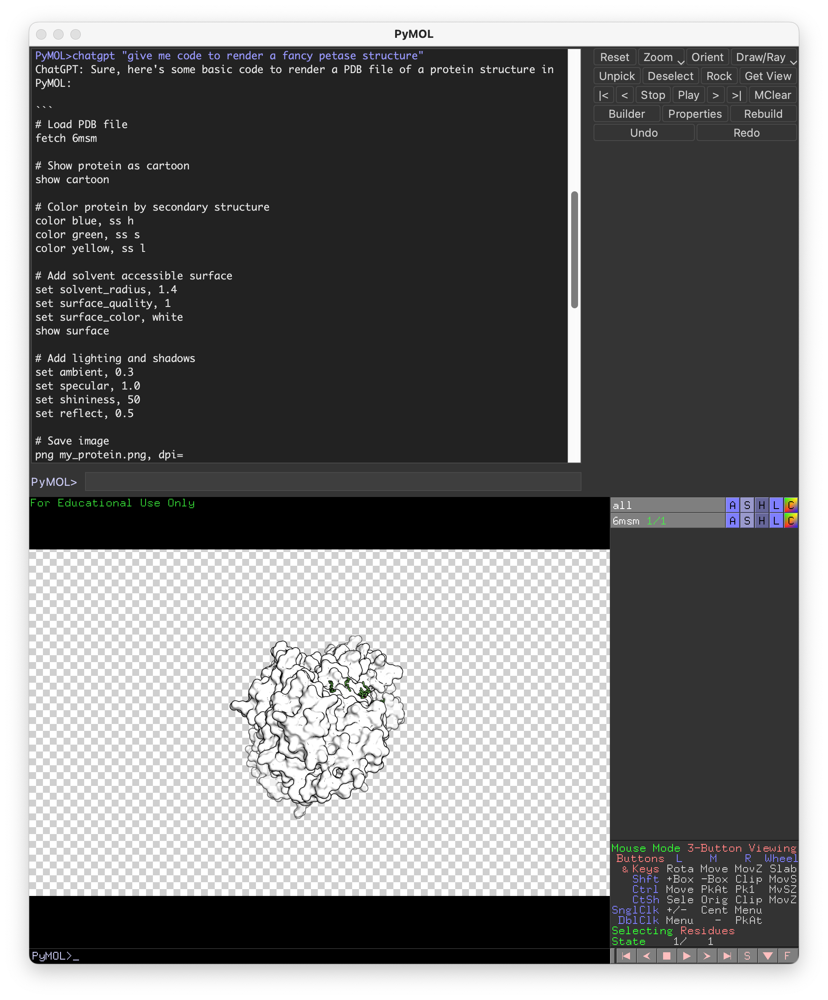

# PyMOL ChatGPT Plugin
<!--  -->
## Overview
The PyMOL ChatGPT Plugin seamlessly integrates OpenAI's GPT-3.5-turbo model into PyMOL, enabling users to interact with PyMOL through natural language instructions. This powerful tool simplifies PyMOL tasks and provides suggestions, explanations, and guidance on various PyMOL-related topics.

## Requirements
- PyMOL
- OpenAI Python package: To install, enter `pip install openai` in the PyMOL command line.

## Installation
1. Download the plugin script `chatmol.py` and save it to a convenient location on your computer.
2. Open PyMOL.
3. In the PyMOL command line, enter `run /path/to/chatmol.py` (replace `/path/to` with the actual path to the script).
4. The plugin is now installed and ready to use.

Alternatively, you can use the following command to load the plugin directly:


```
load https://raw.githubusercontent.com/JinyuanSun/ChatMol/main/chatmol.py
```

If you want a permentally installation, click `Plugin`, go to the `Plugin Manager`, navigate to the `Install New Plugin`, choose the local file or fetch from the url: `https://raw.githubusercontent.com/JinyuanSun/ChatMol/main/chatmol.py`

## Usage
1. Set your OpenAI API key by entering the following command in the PyMOL command line: `set_api_key your_api_key_here` (replace `your_api_key_here` with your actual API key). The API key will be saved in the same directory as the plugin script for future use.

2. Execute PyMOL commands automatically with the ChatGPT Plugin. In PyMOL command line, use `chat` as the wake up word for ChatGPT plugin, followed by a message of your PyMOL tasks or even a question for how to use some of the PyMOL commands. Detailed instructions on how to use PyMOL commands will be displaed and the commands will be executed automatically by default. For example, `chat Show me example to color a protein by its secondary structures`. An example protein molecule will be displayed in PyMOL 3D window with molecule colored by its seconary structure. 

3. Ask ChatMol about how to perform PyMOL tasks without execution the PyMOL commands. You can disable the automatic execution by adding a question mark `?` at the end of ChatMol prompt, e.g., `chat How do I align two proteins?`. You will receive a helpful response such as:
```text
ChatGPT: To align two proteins in PyMOL, you can use the `align` command. Here's an example:
 
``
# Load two proteins
fetch 1ake
fetch 1tim
 
# Align 1tim onto 1ake
align 1tim, 1ake
``
 
In this example, we first load two proteins using the `fetch` command. If you already have the proteins loaded, you can skip this step.
 
Next, we use the `align` command to align `1tim` onto `1ake`. The first argument is the object to be aligned (`1tim`), and the second argument is the reference object (`1ake`). PyMOL will align the two proteins based on their structural similarity, and create a new object with the aligned structure.
 
You can also specify which atoms to use for the alignment by adding the `atommask` option. For example:
 
``
# Align 1tim onto 1ake using only the backbone atoms
align 1tim and name CA+C+N+O, 1ake and name CA+C+N+O
``
 
In this example, we use the `and` operator to select only the backbone atoms (`CA`, `C`, `N`, and `O`) for both proteins. This can be useful if you only want to align the backbone of the proteins, and ignore any side chain differences.
```
  commands from each query will be saved internally. if you want to execute all saved commands, run `chat e` or `chat execute`. After execution, the stashed commands are cleared.

4. To start a new chat session, just enter the following in the PyMOL command line: `chat new`. This will let ChatMol clear the conversation history.


## Features
- Seamless integration with PyMOL.
- User-friendly command-line interface.
- Persistent API key storage for convenient one-time setup.
- Utilizes OpenAI's GPT-3.5-turbo model for powerful, context-aware suggestions and guidance.

## Limitations
- The plugin relies on the OpenAI API, so an internet connection and API key are required for usage.
- The ChatGPT model's knowledge is based on the training data available up to September 
## Support
For any questions or issues related to the PyMOL ChatGPT Plugin, please refer to the official PyMOL mailing list or OpenAI's documentation and support resources.

## License
This project is released under the MIT License.
