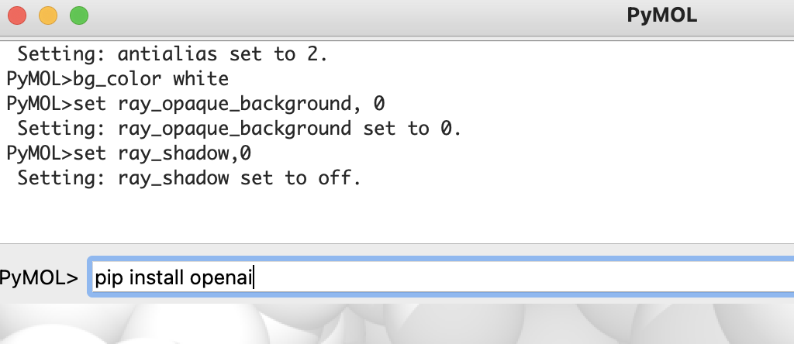
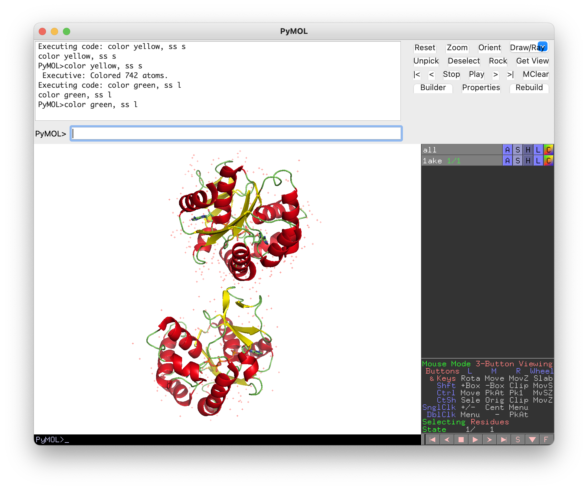
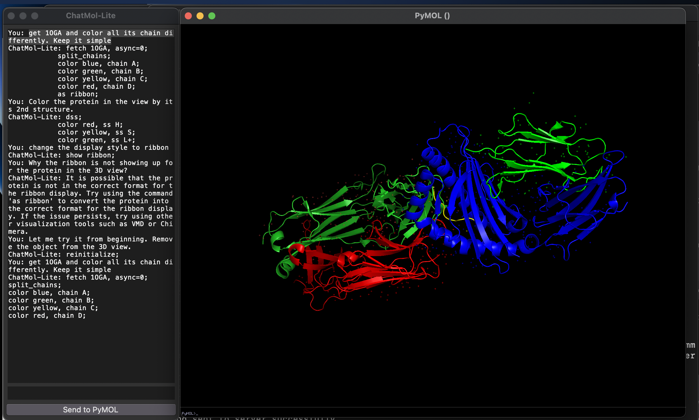

# PyMOL ChatGPT Plugin

## Table of contents
- [PyMOL ChatGPT Plugin](#pymol-chatgpt-plugin)
  - [Table of contents](#table-of-contents)
  - [Overview](#overview)
  - [ChatMol Website](#chatmol-website)
  - [Requirements \& Installation](#requirements--installation)
  - [ChatMol API Key Setup](#chatmol-api-key-setup)
  - [Usage](#usage)
    - [ChatMol as a Task Execution Agent](#chatmol-as-a-task-execution-agent)
    - [ChatMol as a Q\&A Chatbot](#chatmol-as-a-qa-chatbot)
    - [Want to start over again?](#want-to-start-over-again)
    - [ChatMol-Lite](#chatmol-lite)
    - [miniGUI](#minigui)
  - [License](#license)

## Overview
The PyMOL ChatGPT Plugin seamlessly integrates OpenAI's large language models (GPT-3.5-turbo and text-davinci-003) into PyMOL, enabling users to interact with PyMOL using natural language instructions. This robust tool simplifies PyMOL tasks and offers suggestions, explanations, and guidance on a wide range of PyMOL-related topics. ChatMol provides various interaction modes with PyMOL, including the PyMOL command line, miniGUI chatbot, and web browsers.

## ChatMol Website

- Visit the [official website](https://chatmol.org) for comprehensive information about its development and use cases.

- The [Online Chatbot](https://chatmol.org/qa/) is a Q&A system designed to answer questions related to PyMOL usage.

- The [ChatMol web-browser interface](http://xp.chatmol.org/chatmol.html) allows you to submit PyMOL requests and execute them in PyMOL via ChatMol. (Please note that this feature is browser setting-dependent)

## Requirements & Installation


- PyMOL can be installed using `conda install -c conda-forge pymol-open-source`.
- OpenAI Python package: To install, enter `pip install openai` in the PyMOL command line.
- Download the plugin script `chatmol.py` and save it to a convenient location on your computer.
- Launch PyMOL.
- In the PyMOL command line, enter `run /path/to/chatmol.py` (replace `/path/to` with the actual path to the script).
- Create a .PyMOL folder in your home director for saving PyMOL-related files, like ChatGPT API keys, PyMOL license file, etc.
- The plugin is now installed and ready to use.

Alternatively, you can use the following command to load the plugin directly:

```
load https://raw.githubusercontent.com/JinyuanSun/ChatMol/main/chatmol.py
```

For permanent installation, click on `Plugin`, navigate to the `Plugin Manager`, go to `Install New Plugin`, and either choose the local file or fetch from the URL: `https://raw.githubusercontent.com/JinyuanSun/ChatMol/main/chatmol.py`

## ChatMol API Key Setup

Set your OpenAI API key by entering the following command in the PyMOL command line: `set_api_key your_api_key_here` (replace `your_api_key_here` with your actual API key). The API key will be stored in the same directory as the plugin script for future use.

## Usage

ChatMol offers two interaction modes in the PyMOL command line: ChatMol and ChatMol-Lite. ChatMol directly utilizes OpenAI's GPT-3.5 model and requires an API key setup, whereas ChatMol-Lite is built on text-davinci-003 and supplemented with additional PyMol-related resources. Currently, ChatMol-Lite is undergoing rapid development, providing faster performance and eliminating the need for an API key setup for end users.

### ChatMol as a Task Execution Agent

The ChatGPT Plugin automates PyMOL tasks with ease. In the PyMOL command line, just enter `chat` as the trigger word for the ChatMol plugin, followed by your PyMOL task description or questions about specific PyMOL commands. After entering your requests, a set of instructions will appear, and the commands for completing your tasks will be automatically executed by default. For example, use `chat Show me how to color a protein by its secondary structures` to view a protein molecule in the PyMOL 3D window, with colors representing its secondary structures.



### ChatMol as a Q&A Chatbot

ChatMol also serves as a Q&A chatbot, answering your queries about executing PyMOL tasks without actually performing the PyMOL. 
You can disable the automatic execution by adding a question mark `?` at the end of ChatMol prompt, e.g., `chat How do I align two proteins?`. You will receive a helpful response such as:
   
````
ChatGPT: To align two proteins in PyMOL, you can use the `align` command. Here's an example:

```
# Load two proteins
fetch 1ake
fetch 1ttt

# Align the two proteins
align 1ake, 1ttt

# Show the aligned proteins
show cartoon
```

In this example, we first load two proteins using the `fetch` command. If you already have the proteins loaded, you can skip this step.

Next, we use the `align` command to align the two proteins. The first argument is the reference protein (the one that will not move), and the second argument is the mobile protein (the one that will be aligned to the reference). In this case, we're aligning 1ake to 1ttt.

Finally, we use the `show` command to display the aligned proteins in cartoon representation.

Note that the `align` command will superimpose the mobile protein onto the reference protein, so that the two proteins have the same orientation and position.

````
  commands from each query will be saved internally. if you want to execute all saved commands, run `chat e` or `chat execute`. After execution, the stashed commands are cleared.

### Want to start over again?
To start a new chat session, just enter the following in the PyMOL command line: `chat new`. This will let ChatMol clear the conversation history.

### ChatMol-Lite
We found the response of gpt-3.5 is slow and people might don't have access to OpenAI's API, we developed chatmol-lite as an alternative. This is installed with the chatmol automatically. You can use it by typing `chatlite` in the PyMOL command line:
```bash
chatlite "Something you want chatmol to do for you"
```
**`chatlite` is different from the `chat`:**
1. Although it is a chatbot and have memory, it is designed to directly execute commnads based on your instructions. 
2. You can chat with ChatMol-Lite at [here](https://chatmol.org/qa/), the model is the same as the `chatlite`
3. It is much faster than the `chat` and you don't need to set up the OpenAI API key. And the response is more short than the `chat` .

### miniGUI
We also provide a miniGUI for ChatMol-Lite, which can be used as a task execution agent or Q&A chatbot. It retains your entire conversation history with ChatMol, and you have the flexibility to modify the execution plan suggested by ChatMol. For example, you can delete certain commands or add additional commands before sending them to PyMOL. You can launch the miniGUI from a terminal.

```bash
git clone https://github.com/JinyuanSun/ChatMol.git
cd ChatMol/miniGUI
python miniGUI.py
```
Here is a screenshot of the miniGUI:



## License
This project is released under the MIT License.
