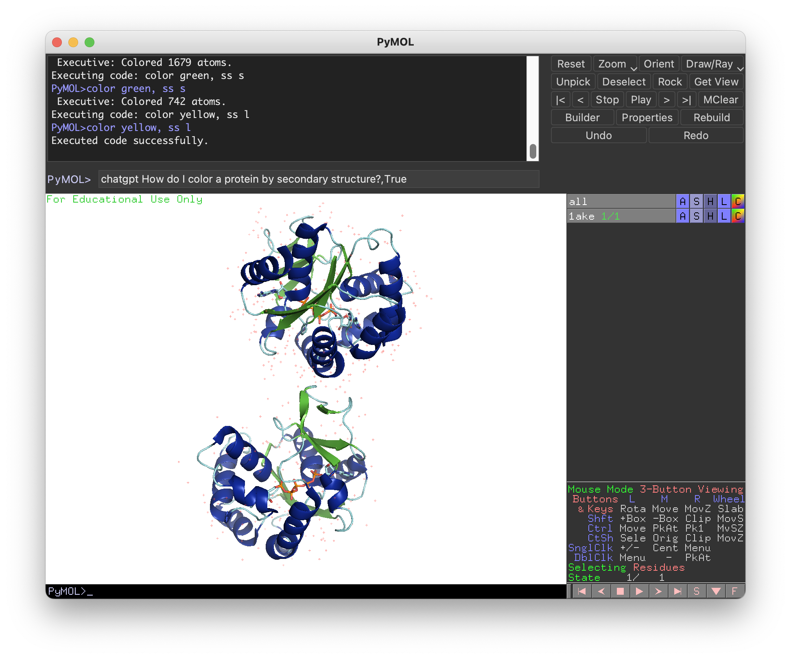

# PyMOL ChatGPT Plugin
<!--  -->
## Overview
The PyMOL ChatGPT Plugin seamlessly integrates OpenAI's GPT-3.5-turbo model into PyMOL, enabling users to interact with PyMOL through natural language instructions. This powerful tool simplifies PyMOL tasks and provides suggestions, explanations, and guidance on various PyMOL-related topics.

## Requirements
- PyMOL
- OpenAI Python package: To install, enter `pip install openai` in the PyMOL command line.

## Installation
1. Download the plugin script `chatgpt.py` and save it to a convenient location on your computer.
2. Open PyMOL.
3. In the PyMOL command line, enter `run /path/to/chatgpt.py` (replace `/path/to` with the actual path to the script).
4. The plugin is now installed and ready to use.

Alternatively, you can use the following command to load the plugin directly:


```
load https://raw.githubusercontent.com/JinyuanSun/ChatMol/main/chatmol.py
```

## Usage
1. Set your OpenAI API key by entering the following command in the PyMOL command line: `set_api_key your_api_key_here` (replace `your_api_key_here` with your actual API key). The API key will be saved in the same directory as the plugin script for future use.
2. Ask ChatGPT about how to perform PyMOL tasks. Use the `chatgpt` command followed by your question or message in the PyMOL command line, e.g., `chatgpt "How do I align two proteins?”`. You will receive a helpful response such as:
```text
ChatGPT: To align two proteins in PyMOL, you can use the `align` command. Here's an example: 
 
```python
# Load the two protein structures
fetch 1ake
fetch 4ake
 
# Align the two structures
align 1ake, 4ake
``
 
In this example, we first load two protein structures using the `fetch` command. Then, we use the `align` command to align the two structures. The first argument to the `align` command is the reference structure (the one that will not be moved), and the second argument is the mobile structure (the one that will be moved to align with the reference structure). 
 
By default, the `align` command aligns the two structures based on their backbone atoms. You can also specify which atoms to use for the alignment by adding the `atommask` option to the `align` command. For example:
 
```python
# Align the two structures using only the alpha-carbon atoms
align 1ake and name ca, 4ake and name ca
``
 
In this example, we use the `name` selection operator to select only the alpha-carbon atoms (`ca`) of both structures for the alignment.
```
3. Execute PyMOL commands automatically with the ChatGPT Plugin by adding a command execution flag “True” at the end of the prompt, like `chatgpt How do I color a protein by secondary structure?, True`.



## Features
- Seamless integration with PyMOL.
- User-friendly command-line interface.
- Persistent API key storage for convenient one-time setup.
- Utilizes OpenAI's GPT-3.5-turbo model for powerful, context-aware suggestions and guidance.

## Limitations
- The plugin relies on the OpenAI API, so an internet connection and API key are required for usage.
- The ChatGPT model's knowledge is based on the training data available up to September 
## Support
For any questions or issues related to the PyMOL ChatGPT Plugin, please refer to the official PyMOL mailing list or OpenAI's documentation and support resources.

## License
This project is released under the MIT License.
