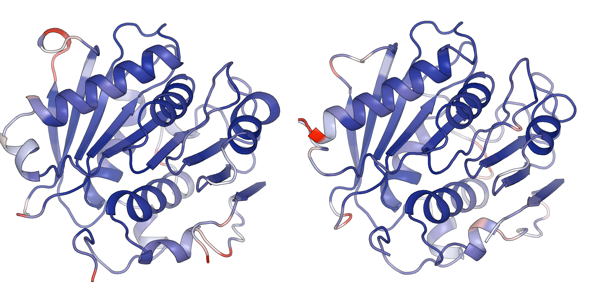
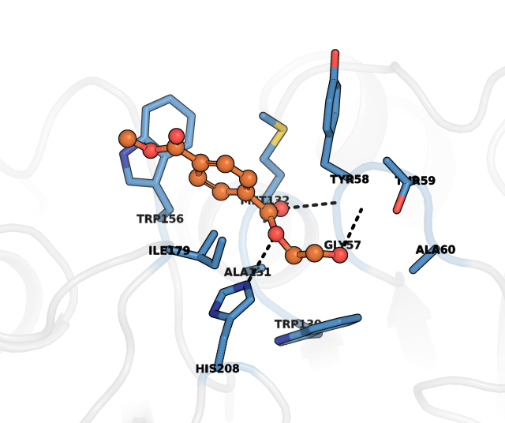
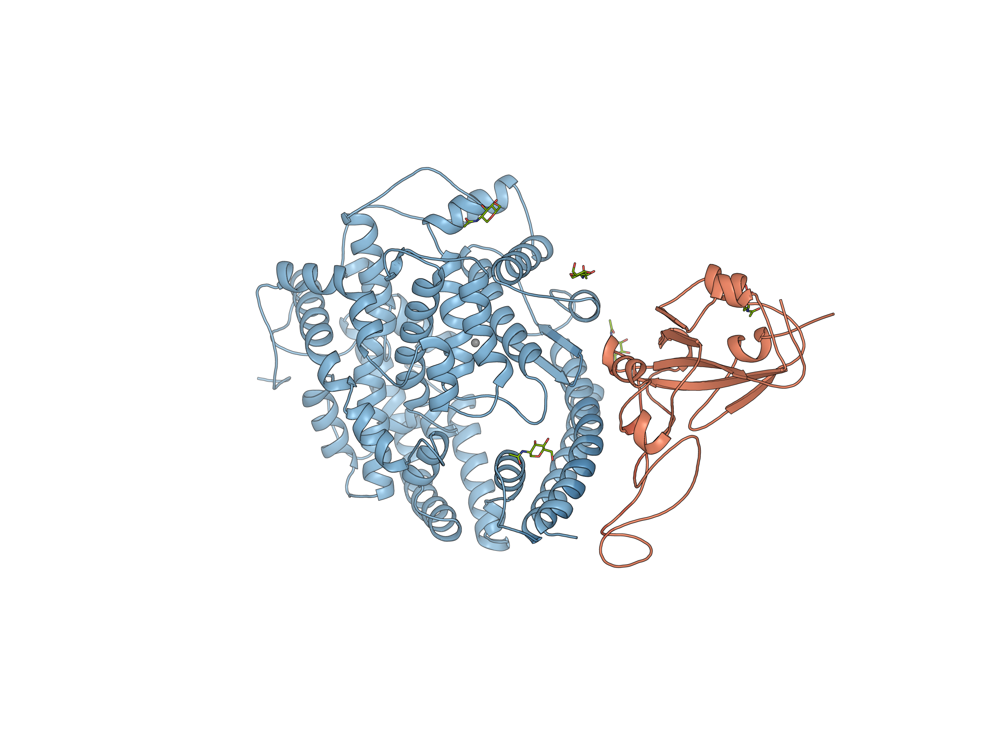

# ChatMol
Started from a PyMol plugin, towards a comprehensive molecular design assistant.

       
Our paper "ChatMol Copilot: An Agent for Molecular Modeling and Computation Powered by LLMs" has been accepted for oral presentation at the First Workshop on Language and Molecules (L+M 2024), co-located with ACL 2024. [](https://aclanthology.org/2024.langmol-1.7/)

## Overview
<details>
<summary>Table of contents</summary>

- [ChatMol](#chatmol)
  - [Overview](#overview)
  - [PyMOL Skill](#pymol-skill)
  - [PyMOL Plugin](#pymol-plugin)
    - [v2 (Recommended)](#v2-recommended)
  - [ChatMol + Streamlit](#chatmol--streamlit)
  - [ChatMol python package](#chatmol-python-package)
  - [Copilot](#copilot)
  - [ChatMol Website](#chatmol-website)
  - [Acknowledgements](#acknowledgements)
  - [License](#license)
</details>

We aim to leverage the capabilities of large language models to better assist scientists in designing new biomolecules. Our journey began with developing a [PyMOL plugin](#pymol-plugin) that automatically translates natural language into commands. From there, we expanded into several domains, including:

- An interactive [Streamlit interface](#chatmol--streamlit)
- A dedicated [Python package](#chatmol-python-package)
- [ChatMol Copilot](#copilot): an automated system capable of executing various tasks including: 
  - Structure prediction
  - Molecular docking
  - Sequence design
  - Small molecule analysis & generation

Through these tools, we strive to empower scientists to better utilize large language models in solving scientific problems. Our goal is to bridge the gap between advanced AI capabilities and practical scientific research needs in molecular biology and related fields.

## PyMOL Skill
A skill that lets agents generate publication-quality molecular structure figures using PyMOL. You describe what you want to see, a binding site for example, and the LLM writes a `.pml` script, runs it headlessly, and hands you the rendered PNG, the script, and a `.pse` session file you can open in PyMOL to keep tweaking.
**How to Install?**
The easiest way to use the PyMOL skill is through **coding agent** or **openclaw**. Simply ask it to `Install the PyMOL skill from https://github.com/ChatMol/ChatMol/tree/main/pymol_skill` and it will automatically set it up for you.

If you prefer to do it manually, drop the `pymol_skill/` folder into your skills directory:

- **Claude Code:** place in `.claude/skills/` in your project root, or in `~/.claude/skills/` for global access
- **Codex / other agents:** point the skill config to the folder so the agent reads `SKILL.md` on trigger

<!-- a table of figures -->
| Protein overview                          | Binding site                        | Protein-protein interface       |
| ----------------------------------------- | ----------------------------------- | ------------------------------- |
|  |  |  |
| compare 4eb0 and 5xh3                     | show ligand interactions in 5xh3    | show PPI interface in 6m0j      |

## PyMOL Plugin

An LLM-powered plugin for PyMOL that translates natural language into molecular visualization workflows.

**Versions**

| Directory          | Description                                                                              |
| ------------------ | ---------------------------------------------------------------------------------------- |
| `pymol_plugin/v2/` | Agentic plugin with tool-calling loop, session inspection, vision feedback, and Qt5 GUI. |
| `pymol_plugin/v1/` | Original plugin with direct LLM-to-command translation.                                  |

### v2 (Recommended)

**Installation**
```python
run /path/to/pymol_plugin/v2/chatmol.py
```

**Quick start**
```pymol
set_api_key sk-or-xxxx
chat fetch 1ubq and show as cartoon
chat fetch 3wzm, show enzyme-substrate interactions in chain A with publication quality
```

Supported providers include OpenRouter, DeepSeek, Kimi (Moonshot), and GLM via OpenAI-compatible APIs.

<details>
<summary>v1 (Legacy)</summary>

**Installation**
```python
load https://chatmol.com/pymol_plugins/chatmol-latest.py
```

**Quick start**
```pymol
chatlite show me a protein
set_api_key openai, sk-proj-xxxx
chat show me a protein
```

For self-hosted models via Ollama:
```pymol
update_model phi-4@ollama
```

</details>


See the full plugin documentation in [pymol_plugin/README.md](./pymol_plugin/README.md).

## ChatMol + Streamlit

We also provide a Streamlit app for ChatMol, which can be used as a task execution agent or Q&A chatbot. It retains your entire conversation history with ChatMol, and you have the flexibility to modify the execution plan suggested by ChatMol. See more details in [here](./chatmol-streamlit/README.md).

## ChatMol python package

See this [README](./chatmol_pkg/README.md) for more details.

```bash
pip install chatmol
```

## Copilot
This is ChatMol copilot, just like other copilot, it is designed to help your work.  
[](https://www.youtube.com/watch?v=9uMFZMQqTf8)  
See more details in [here](./copilot_public/README.md)

## ChatMol Website

- Visit the [official website](https://chatmol.org) for comprehensive information about its development and use cases.

- The [ChatMol web-browser interface](http://xp.chatmol.org/chatmol.html) allows you to submit PyMOL requests and execute them in PyMOL via ChatMol. (Please note that this feature is browser setting-dependent)

## Acknowledgements

As an open source project, we thank the support from [ChemXAI](https://www.chemxai.com/), [WeComput](https://www.wecomput.com/) and [Levinthal](https://www.levinthal.bio/).

## License
This project is released under the MIT License.
