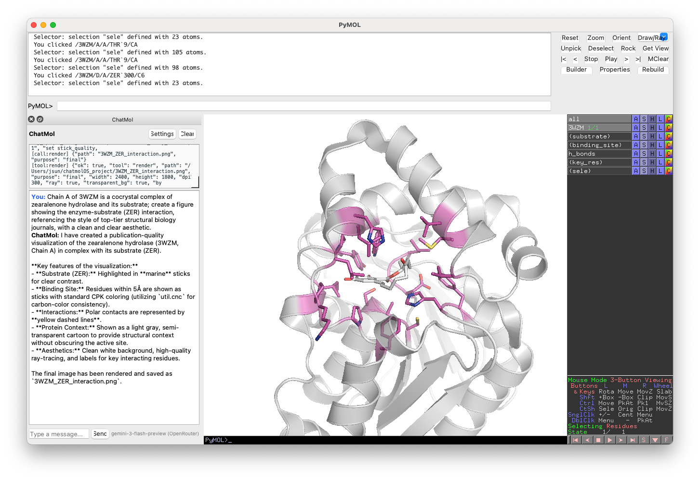

# ChatMol PyMOL Plugin

An LLM-powered agentic plugin for PyMOL that translates natural language into molecular visualizations.

## Versions

| Directory | Description                                                                                                                                      |
| --------- | ------------------------------------------------------------------------------------------------------------------------------------------------ |
| `v1/`     | Original plugin — direct LLM-to-command translation. Supports OpenAI, Anthropic, DeepSeek, Ollama, and the free ChatMol service.                 |
| `v2/`     | Agentic plugin — tool-calling loop with session inspection, vision feedback, and Qt5 GUI. Uses OpenRouter and other OpenAI-compatible providers. |

## v2 — Agentic Plugin

### Installation

In PyMOL's command line:

```python
run /path/to/pymol_plugin/v2/chatmol.py
```

### Supported Providers

v2 routes through OpenAI-compatible APIs. Configure via `set_provider`:

| Provider        | Models                                | API Key Env Var      |
| --------------- | ------------------------------------- | -------------------- |
| OpenRouter      | GPT-4o, GPT-5.2, Gemini 3 Flash, etc. | `OPENROUTER_API_KEY` |
| DeepSeek        | DeepSeek V3, DeepSeek R1              | `DEEPSEEK_API_KEY`   |
| Kimi (Moonshot) | Kimi K2.5                             | `MOONSHOT_API_KEY`   |
| GLM (Zhipu)     | GLM-5                                 | `GLM_API_KEY`        |

### Quick Start

```pymol
# Set your API key (saved to ~/.PyMOL/chatmol_config.json)
set_api_key sk-or-xxxx

# Chat with the agent
chat fetch 1ubq and show as cartoon

# Multi-step request
chat fetch 3wzm, show enzyme-substrate interactions in chain A with publication quality
```



### Commands

| Command                | Description                                       |
| ---------------------- | ------------------------------------------------- |
| `chat <message>`       | Send a message to the agent                       |
| `set_provider <name>`  | Switch provider (openrouter, deepseek, kimi, glm) |
| `set_api_key <key>`    | Set API key for the current provider              |
| `set_model <model>`    | Set the text model                                |
| `set_vision_model <m>` | Set the vision model for visual QA                |
| `reset_conversation`   | Clear conversation history                        |
| `save_conversation`    | Save conversation to JSON                         |
| `load_conversation`    | Load conversation from JSON                       |
| `chatmol_config`       | Show current configuration                        |
| `chatmol_settings`     | Open the Qt settings dialog                       |
| `chatmol_gui`          | Open the Qt chat bar                              |

### Architecture

The v2 plugin uses a simple agentic loop: call the LLM, execute tool calls, repeat until the LLM produces a final text response.

**4 tools:**

| Tool                 | Purpose                                                    |
| -------------------- | ---------------------------------------------------------- |
| `inspect_session`    | Get current PyMOL state (objects, chains, atoms)           |
| `run_pymol_commands` | Execute arbitrary PyMOL commands (with safety blocklist)   |
| `render`             | Export image (preview or publication quality)              |
| `capture_viewport`   | Screenshot + vision model analysis for iterative visual QA |

The LLM knows PyMOL — it uses `cmd.select`, `cmd.show`, `cmd.color`, `cmd.distance`, `preset.ligand_sites_hq`, etc. all through `run_pymol_commands`. A safety blocklist prevents destructive commands (`quit`, `reinitialize`, shell commands).

**Qt5 GUI:** When PyMOL has Qt available, a chat bar docks to the bottom of the main window with a settings dialog, execution trace panel, and animated thinking indicator.

### Configuration

Settings are persisted to `~/.PyMOL/chatmol_config.json`:

- `provider` — API provider name
- `api_keys` — per-provider API keys
- `text_model` — model for chat completions
- `vision_model` — model for visual QA (capture_viewport)
- `temperature`, `max_tokens`, `max_iterations`, `max_tool_calls`

## v1 — Original Plugin

### Installation

```python
load https://chatmol.com/pymol_plugins/chatmol-latest.py
```

### Supported Providers

| Provider  | Models               | GPU Required | API Key Required | Notes               |
| --------- | -------------------- | ------------ | ---------------- | ------------------- |
| OpenAI    | GPT Models           | No           | Yes              | Commercial API      |
| Anthropic | Claude Models        | No           | Yes              | Commercial API      |
| DeepSeek  | DeepSeek Models      | No           | Yes              | Commercial API      |
| Ollama    | LLaMA, Mixtral, etc. | Yes          | No               | Self-hosted models  |
| ChatMol   | ChatMol Model        | No           | No               | Free hosted service |

### Quick Start

```pymol
# Free service, no API key needed
chatlite show me a protein

# With an API key
set_api_key openai, sk-proj-xxxx
chat show me a protein
```

For self-hosted models via Ollama:
```pymol
update_model phi-4@ollama
```
